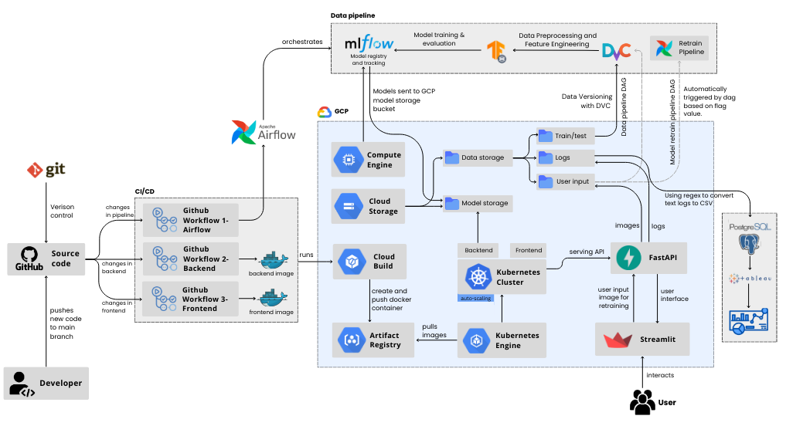
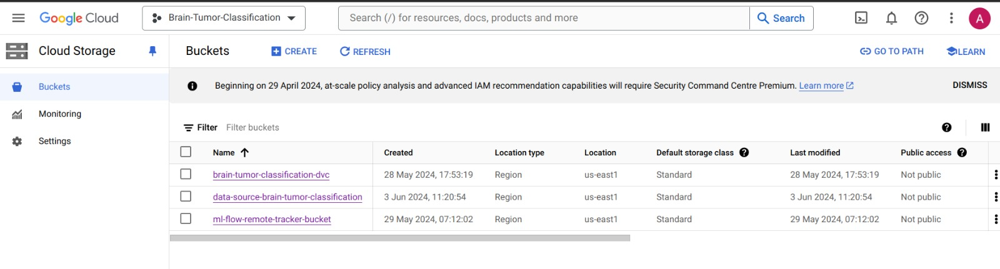
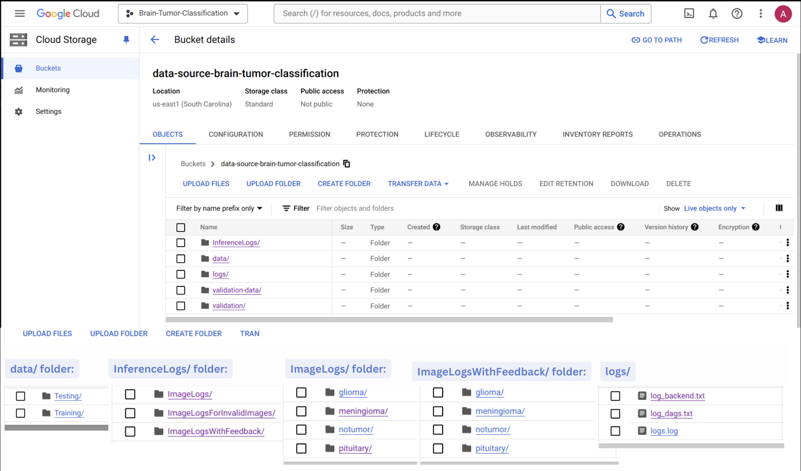
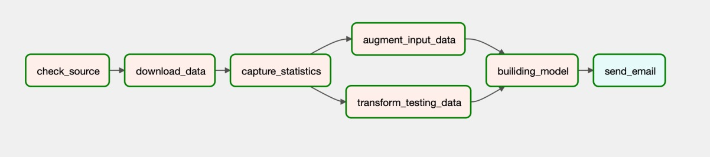
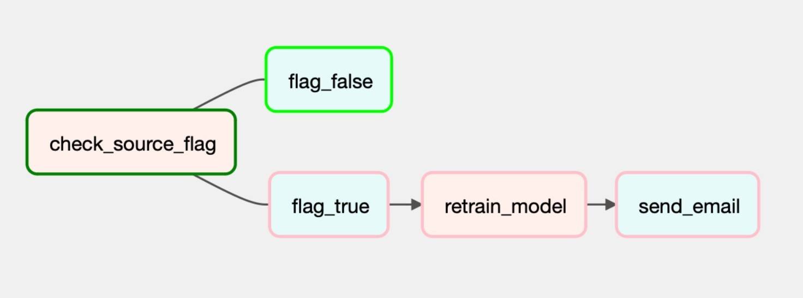
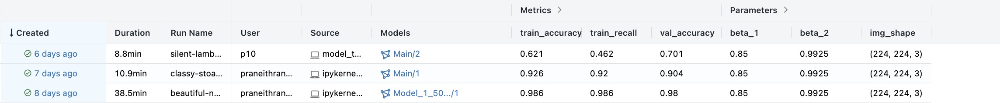
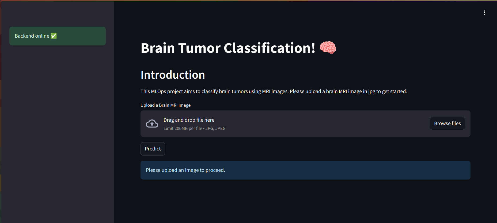
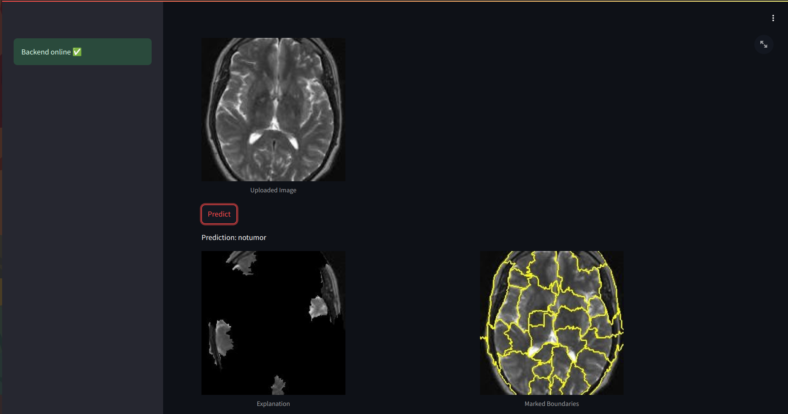
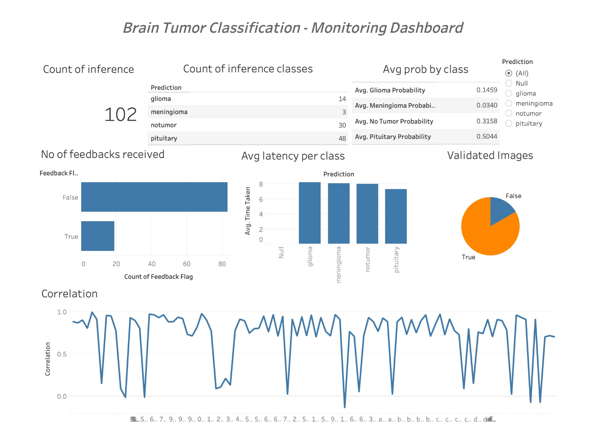

# Brain-Tumor-Classification


This project is designed to develop, deploy, and maintain a machine learning model for brain tumor classification. The project utilizes a Machine Learning Operations (MLOps) approach to streamline the development, deployment, and monitoring of the model. The project directory is structured to support data version control, modular coding, and containerized deployment.

## Table of Contents

1. [Introduction](#introduction)
2. [Dataset Information](#dataset-information)
3. [Project Workflow](#project-workflow)
4. [Prerequisites](#prerequisites)
5. [Description of Files and Folders](#description-of-files-and-folders)
    - [Project Structure](#project-structure)
    - [Source Code Files](#source-code-files)
6. [Data Storage and Model Registry](#data-storage-and-model-registry)
7. [Airflow Pipelines](#airflow-pipelines)
    - [Data and Model Build Pipeline](#data-and-model-build-pipeline)
    - [Model Retraining Pipeline](#model-retraining-pipeline)
8. [Application Interface](#application-interface)
9. [Monitoring Dashboard](#monitoring-dashboard)
9. [Contributors](#contributors)

## Introduction

Brain tumors are one of the more common types of cancer, with approximately 24,810 adults in the United States diagnosed in 2023. The complexity and variability of brain tumors make accurate diagnosis challenging. Traditional methods rely on MRI, CT, and PET imaging techniques to indicate the presence of a tumor, with further classification often requiring invasive procedures such as stereotactic needle biopsy or open biopsy (craniotomy). These techniques are costly, time-consuming, and carry risks such as infection and other surgical complications.

Motivated by these challenges, we chose this topic for our MLOps project. By leveraging the principles of MLOps, we have developed an end-to-end ML pipeline for automated brain tumor detection. Our goal is to enhance the accuracy and efficiency of non-invasive imaging techniques, potentially reducing the need for invasive procedures. This approach aims to provide scalable, reliable, and timely diagnostic support.

## Dataset Information

The dataset combines MRI images from three sources: figshare, SARTAJ, and Br35H. It includes 7023 JPEG images of human brains, categorized into four classes: glioma, meningioma, no tumor, and pituitary.

- **Dataset Name**: Brain Tumor MRI Images
- **Size**: 7023 images
- **Format**: JPEG
- **Classes**: Glioma, Meningioma, No Tumor, Pituitary
- **Sources**:
  - [figshare](https://figshare.com/articles/dataset/brain_tumor_dataset/1512427)
  - [SARTAJ](https://www.kaggle.com/datasets/sartajbhuvaji/brain-tumor-classification-mri)
  - [Br35H](https://www.kaggle.com/datasets/ahmedhamada0/brain-tumor-detection?select=no)

All data used are sourced from publicly available datasets with proper usage permissions.

## Project Workflow



## Prerequisites

Before you begin, ensure you have the following installed on your machine:

- [Git](https://www.git-scm.com/downloads)
- [Docker](https://www.docker.com/get-started/)
- [Airflow](https://airflow.apache.org/docs/apache-airflow/stable/start.html)
- [DVC](https://airflow.apache.org/docs/apache-airflow/stable/start.html) (Data Version Control)
- [Python](https://www.python.org/downloads/) 3.x
- Pip (Python package installer)
- Google Cloud Platform (GCP) Account


## Description of Files and Folders
#### Project Structure:
```plaintext
├── .dvc
│   ├── config
│   ├── .gitignore
├── data
│   ├── Testing
│   │   ├── ...
│   ├── Training
│   │   ├── ...
├── frontend
│   ├── app.py
│   ├── dockerfile
│   ├── requirements.txt
│   ├── kubernetes
│       ├── deployment.yaml
│       ├── namespace.yaml
│       ├── service.yaml
├── backend
├── src
│   ├── dags
│   │   ├── scripts
│   │       ├── logger.py
│   │       ├── preprocessing.py
│   │       ├── statistics.py
│   │   ├── datapipeline.py
│   └── keys
│       ├── keyfile.json
├── .dvcignore
├── .gitignore
├── data.dvc
├── dockerfile
├── entrypoint.sh
├── requirements.txt
```

#### Source Code Files:

**The below files are in the `src` folder**

1. **Data Pipeline**

   - `datapipeline.py`: Orchestrates the entire data processing workflow, including data ingestion, preprocessing, and feature engineering.

2. **Logging Configuration**

   - `logger.py`: Configures the logging system for the project, defining log formats, levels, and handlers to ensure proper tracking and debugging of processes.

3. **Initial Preprocessing**

   - `preprocessing.py`: Performs initial preprocessing tasks on the dataset, such as cleaning, normalization, and transformation of raw data into a suitable format for further analysis and model training.

4. **Statistical Analysis**

   - `statistics.py`: Conducts statistical analysis on the dataset, calculating various descriptive statistics and generating insights about the data distribution and relationships between features.

5. **Machine Learning Experiment Tracking**

   - `example-mlflow.ipynb`: A Jupyter notebook demonstrating the use of MLflow for tracking machine learning experiments, including logging parameters, metrics, and model artifacts.             |


## Data storage and Model Registry:

### 1. Storage buckets


### 2. Data buckets

- `/data`: This directory contains the dataset used for training and testing the ML model.
- `InferenceLogs/`: This directory is dedicated to storing inference logs, facilitating model evaluation and improvement:
  - `ImageLogs/`: Subfolder for storing user input images along with correct predictions made by the model. These logs are valuable for validating model accuracy.
  - `ImageLogsWithFeedback/`: Subfolder for storing user input images that were incorrectly predicted by the model, categorized by the label provided by the user. This data is essential for retraining and enhancing the model's performance.
  - `ImageLogsForInvalidImages/`: Subfolder for storing user input images that where invalid or images that where not Brain MRI. 



## Airflow Pipelines:

#### 1. Data and model build pipeline

1. `check_source`: Checking the data source to verify its availability.
2. `download_data`: Downloading the necessary data if the source is valid.
3. `capture_statistics`: Captures statistics about the data, such as summary statistics, distributions, and other relevant metrics. This step also generates a histogram.pkl file that is used by our system for user input image validation.
4. `augment_input_data`: This step preprocesses the images by normalizing the pixel values. We have also applied several augmentations to enhance the robustness of our model such as rotating images, shifting them horizontally and vertically, shearing up to 10 degrees, zooming in or out, and randomly flipping them horizontally. Any empty areas created by these transformations are filled using the nearest pixel values. 
5. `transform_testing_data`: Here the test images are normalized to ensure they are in the correct format for our model, improving its performance and accuracy.
6. `building_model`: Builds the machine learning model using the prepared data and send it to mlfow server where it can be registered. 
7. `send_email`: Sends an email notification upon a successful model build.



#### 2. Model Retraining pipeline

1. `check_source_flag`: Checks if there are more than 50 images with feedback predicted images in the bucket.
2. `flag_false`: Ends the process if there are 50 or fewer wrongly predicted images.
3. `flag_true`: Proceeds to model retraining if there are more than 50 wrongly predicted images.
4. `retrain_model`: Initiates the re-training of the model with updated data and stores the model in mlflow.
5. `send_email`: Sends an email notification once model retraining is completed.



Once the retraing is completed, we will have the new model registered on the mlflow server. We can then compare this new retrained model with the previous mdoels based on the below metrics table. 
If the performance has improved we can proceed by registering the model and deploying it. After this the system will automatically use this new model for new predictions.

### Model Metrics Table



## Application Interface

Below is the interface of our brain tumor classification system, where users can upload MRI images in JPEG or JPG format. If a non-brain MRI image is uploaded, the UI will reject it. For valid images, the system provides a prediction, and users can submit feedback if they find the prediction unsatisfactory or incorrect. This feedback will be stored to improve our system.

Link: `http://35.231.160.55/`

 > [!IMPORTANT]
 > <i> Please note that any images you upload will be stored with us. By uploading an image, you consent to its storage and use for the purposes of improving our brain tumor classification model. We are committed to ensuring the privacy and security of your data and will not share it with any third parties without your explicit consent. </i>





## Monitoring Dashboard

The below monitoring dashboard provides a comprehensive view of the performance and usage of our brain tumor classification system.

1. **Count of Inferences**- To give a basic overview of the total number of inferences (predictions) made by the system.

2. **Count of Inference Classes**-Break down  the number of inferences made for each class which will help in understanding the distribution of predictions across different tumor types. 

3. **Average Probability by Class**- To get an insight into the model's confidence in its predictions for each class.

4. **Number of Feedbacks Received**- This bar chart shows the number of feedback entries received, categorized by whether the feedback indicated a correct (True) or incorrect (False) prediction. This metric helps in monitoring the accuracy and reliability of the model.

5. **Average Latency per Class**- This bar chart displays the average time taken to generate predictions for each class. It helps in assessing the performance and efficiency of the model in processing different types of MRI images.

6. **Validated Images**- This pie chart shows the proportion of images that were validated (correctly classified) versus those that were not. It provides a quick visual representation of the model's validation accuracy.

7. **Correlation**- The correlation chart indicates the validation status of user-input images. A value of 1 means a high correlation with our histogram.pkl file, confirming the image as a valid MRI. A value of 0 indicates a low correlation, suggesting the image may not be a valid MRI. If we notice a high frequency of 0 correlations, it may signal an issue with the validation process, potentially due to changes in MRI image formats. This will prompt us to review validation logs and update our system accordingly.



## Contributors

[Aadrash Siddha](https://github.com/Omii2899)  <br>
[Akshita Singh](https://github.com/akshita-singh-2000) <br>
[Praneith Ranganath](https://github.com/P101010) <br>
[Shaun Kirtan](https://github.com/)- <br> [Yashasvi Sharma](https://github.com/yashasvi14) 

## Acknowledgments

Special thanks to our Professor, [Ramin Mohammadi](https://github.com/raminmohammadi), for his guidance and support throughout this project.
