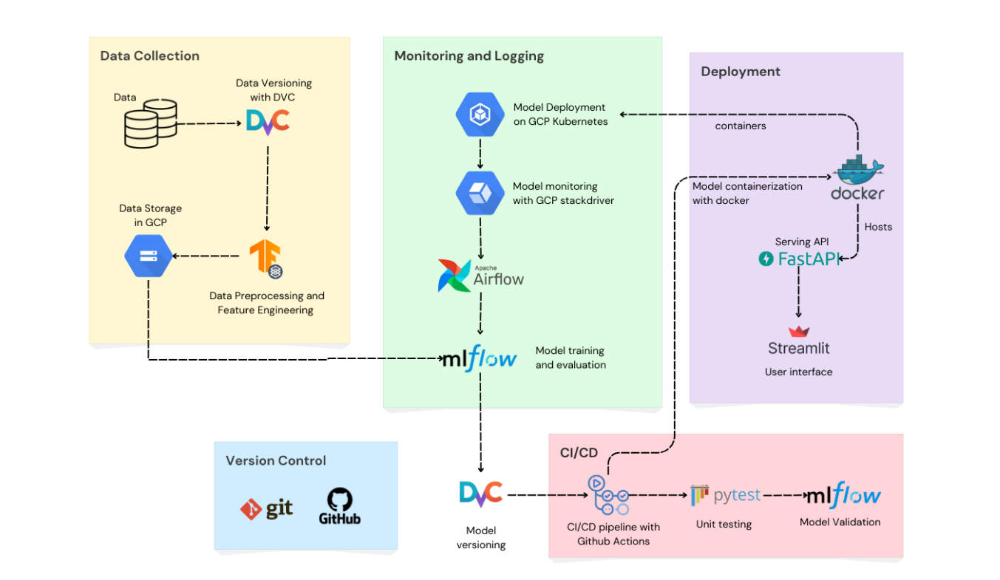
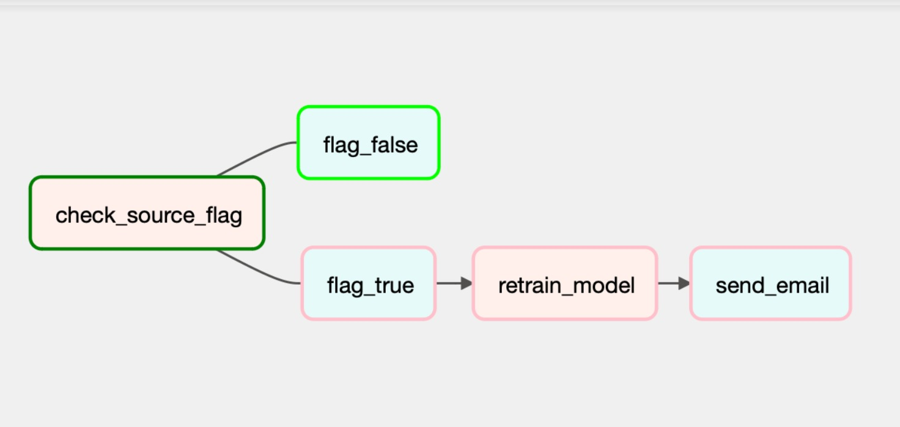

# Brain-Tumor-Classification

This project is designed to develop, deploy, and maintain a machine learning model for brain tumor classification. The project utilizes a Machine Learning Operations (MLOps) approach to streamline the development, deployment, and monitoring of the model. The project directory is structured to support data version control, modular coding, and containerized deployment.

## Introduction

Brain tumors are a significant health challenge, with approximately 24,810 adults in the United States diagnosed in 2023. The complexity and variability of brain tumors make accurate diagnosis difficult, especially in regions lacking skilled medical professionals. This project leverages machine learning to develop an end-to-end ML pipeline for automated brain tumor detection, aiming to provide scalable, reliable, and timely diagnostic support.

## Dataset Information

The dataset combines MRI images from three sources: figshare, SARTAJ, and Br35H. It includes 7023 JPEG images of human brains, categorized into four classes: glioma, meningioma, no tumor, and pituitary.

- **Dataset Name**: Brain Tumor MRI Images
- **Size**: 7023 images
- **Format**: JPEG
- **Classes**: Glioma, Meningioma, No Tumor, Pituitary
- **Sources**:
  - [figshare](https://figshare.com/articles/dataset/brain_tumor_dataset/1512427)
  - [SARTAJ](https://www.kaggle.com/datasets/sartajbhuvaji/brain-tumor-classification-mri)
  - [Br35H](https://www.kaggle.com/datasets/ahmedhamada0/brain-tumor-detection?select=no)

All data used are sourced from publicly available datasets with proper usage permissions.


## Project workflow



## Prerequisites

Before you begin, ensure you have the following installed on your machine:

- [Git](https://www.git-scm.com/downloads)
- [Docker](https://www.docker.com/get-started/)
- [Airflow](https://airflow.apache.org/docs/apache-airflow/stable/start.html)
- [DVC](https://airflow.apache.org/docs/apache-airflow/stable/start.html) (Data Version Control)
- [Python](https://www.python.org/downloads/) 3.x
- Pip (Python package installer)
- Google Cloud Platform (GCP) Account

## Getting Started

To get started with the project, follow these steps:

### 1. Clone the Repository

Clone the repository using the following command:

```
git clone https://github.com/Omii2899/Brain-Tumor-Classification.git
```
```
cd Brain-Tumor-Detection
```

### 2. Create a Python Virtual Environment
Create a virtual environment to manage project dependencies:
```
pip install virtualenv
```
```
python -m venv <virtual_environment_name>
```
```
source <virtual_environment_name>/bin/activate 
```

### 3. Install the Dependencies
Install the necessary dependencies using the requirements.txt file:
```
pip install -r requirements.txt
```

### 4. Get the Data from Remote Source
Pull the data from the remote source using DVC:

```
dvc pull
``` 

### 5. Add the Key File:
You need to add the key file in src/keys folder. For security purposes, we have not included this file. To obtain this file, please contact [Aadarsh](mailto:siddha.a@northeastern.edu)  


## Description of Files and Folders
#### Project Structure:
```
├── .dvc
│   ├── config
│   ├── .gitignore
├── data
│   ├── Testing
│   │   ├── ...
│   ├── Training
│   │   ├── ...
├── frontend
│   ├── app.py
│   ├── dockerfile
│   ├── requirements.txt
│   ├── kubernetes
│       ├── deployment.yaml
│       ├── namespace.yaml
│       ├── service.yaml
├── backend
├── src
│   ├── dags
│   │   ├── scripts
│   │       ├── logger.py
│   │       ├── preprocessing.py
│   │       ├── statistics.py
│   │   ├── datapipeline.py
│   └── keys
│       ├── keyfile.json
├── .dvcignore
├── .gitignore
├── data.dvc
├── dockerfile
├── entrypoint.sh
├── requirements.txt

```

#### Source code files:

<ol>
    <li><strong>Data Version Control (DVC)</strong>
        <ul>
            <li><strong>config</strong>: DVC configuration file for setting up data versioning.</li>
            <li><strong>.gitignore</strong>: Specifies which DVC files should be ignored by Git.</li>
        </ul>
    </li>
    <br>
    <li><strong>Data</strong>
        <ul>
            <li><strong>Testing</strong>: Contains subfolders with testing images.</li>
            <li><strong>Training</strong>: Contains subfolders with training images.</li>
        </ul>
    </li>
    <br>
    <li><strong>Source </strong>
        <ul>
            <li><strong>datapipeline.py</strong>: Orchestrates the data pipeline process, integrating various preprocessing and processing scripts.</li>
            <li><strong>scripts</strong>: 
                <ul>
                    <li><strong>logger.py</strong>: Sets up and configures logging for the project. It creates a logger instance with a specific format and log level.</li>
                    <li><strong>preprocessing.py</strong>: Handles image preprocessing for both training and testing phases using TensorFlow's <code>ImageDataGenerator</code>. It contains two primary functions: <code>preprocessing_for_training </code> that applies various augmentation techniques, such as normalization, rotation, width and height shifts, shearing, zooming, and horizontal flipping, to enhance the training datasetand and <code>preprocessing_for_testing_inference</code> for normalizing the data.</li>
                    <li><strong>statistics.py</strong>: Captures statistics of each image in each class, generates histograms, and validates images against these histograms using OpenCV.</li>
                </ul>
            </li>
        </ul>
    </li>
    <br>
    <li><strong>Configuration and Ignore Files</strong>
        <ul>
            <li><strong>.dvcignore</strong>: Specifies files and directories that DVC should ignore.</li>
            <li><strong>.gitignore</strong>: Specifies files and directories that Git should ignore.</li>
            <li><strong>data.dvc</strong>: DVC data tracking file.</li>
        </ul>
    </li>
    <br>
    <li><strong>Docker Configuration</strong>
        <ul>
            <li><strong>Dockerfile</strong>: Contains instructions to build a Docker image for the project.</li>
        </ul>
    </li>
    <br>
    <li><strong>Entry Point</strong>
        <ul>
            <li><strong>entrypoint.sh</strong>: Shell script to set up the environment and run the application inside Docker.</li>
        </ul>
    </li><br>
    <li><strong>Dependencies</strong>
        <ul>
            <li><strong>requirements.txt</strong>: Lists the Python dependencies needed for the project.</li>
        </ul>
    </li>
</ol>


## Running the data pipeline
To run the pipeline, you can use Docker for containerization.

1. Build the Docker Image
```
docker build -t image-name:tag-name .
```
2. Verify the image 
```
docker images
```

3. Run the built image
```
docker run -it --rm -p 8080:8080 image-name:tag-name
```

The application should now be running and accessible at <code> http://localhost:8080 </code>.

Use the below credentials-
<code> User: mlopsproject</code>
<code> Password: admin</code>

<i>Note: 
If the commands fail to execute, ensure that virtualization is enabled in your BIOS settings. Additionally, if you encounter permission-related issues, try executing the commands by prefixing them with <code>sudo</code></i>.

4. Trigger the airflow UI
```
python src/dags/datapipeline.py
```

### DAG:


1. check_source: Checkint the data source to verify its availability.
2. download_data: Downloading the necessary data if the source is valid.
3. capture_statistics: Captures statistics about the data, such as summary statistics, distributions, and other relevant metrics.
4. augment_input_data: Perfomring data augmentation, feature engineering, and other preprocessing steps.
5. transform_testing_data: Transforming the testing data to ensure it is in the correct format for model evaluation.
6. building_model: Builds the machine learning model using the prepared data.
7. send_email: Sends an email notification upon a successful model build.



## Contributors

[Aadrash Siddha](https://github.com/Omii2899) <br> [Akshita Singh](https://github.com/akshita-singh-2000) <br>  [Praneith Ranganath](https://github.com/Praneith) <br>  [Shaun Kirtan](https://github.com/) <br>   [Yashasvi Sharma](https://github.com/yashasvi14) 
