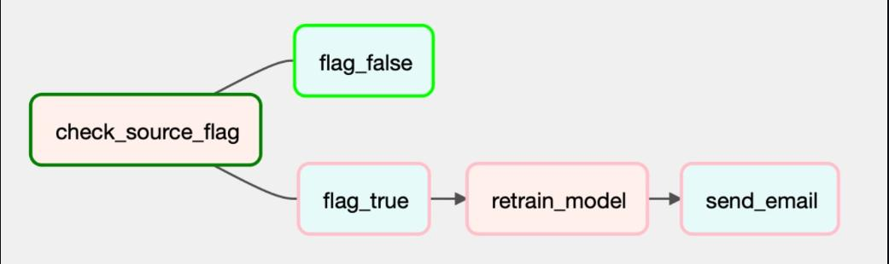

# Brain-Tumor-Classification

This project is designed to develop, deploy, and maintain a machine learning model for brain tumor classification. The project utilizes a Machine Learning Operations (MLOps) approach to streamline the development, deployment, and monitoring of the model. The project directory is structured to support data version control, modular coding, and containerized deployment.

## Introduction

Brain tumors are a significant health challenge, with approximately 24,810 adults in the United States diagnosed in 2023. The complexity and variability of brain tumors make accurate diagnosis difficult, especially in regions lacking skilled medical professionals. This project leverages machine learning to develop an end-to-end ML pipeline for automated brain tumor detection, aiming to provide scalable, reliable, and timely diagnostic support.

## Dataset Information

The dataset combines MRI images from three sources: figshare, SARTAJ, and Br35H. It includes 7023 JPEG images of human brains, categorized into four classes: glioma, meningioma, no tumor, and pituitary.

- **Dataset Name**: Brain Tumor MRI Images
- **Size**: 7023 images
- **Format**: JPEG
- **Classes**: Glioma, Meningioma, No Tumor, Pituitary
- **Sources**:
  - [figshare](https://figshare.com/articles/dataset/brain_tumor_dataset/1512427)
  - [SARTAJ](https://www.kaggle.com/datasets/sartajbhuvaji/brain-tumor-classification-mri)
  - [Br35H](https://www.kaggle.com/datasets/ahmedhamada0/brain-tumor-detection?select=no)

All data used are sourced from publicly available datasets with proper usage permissions.

## Project Workflow


## Prerequisites

Before you begin, ensure you have the following installed on your machine:

- [Git](https://www.git-scm.com/downloads)
- [Docker](https://www.docker.com/get-started/)
- [Airflow](https://airflow.apache.org/docs/apache-airflow/stable/start.html)
- [DVC](https://airflow.apache.org/docs/apache-airflow/stable/start.html) (Data Version Control)
- [Python](https://www.python.org/downloads/) 3.x
- Pip (Python package installer)
- Google Cloud Platform (GCP) Account

## Getting Started

To get started with the project, follow these steps:

### 1. Clone the Repository

Clone the repository using the following command:

```sh
git clone https://github.com/Omii2899/Brain-Tumor-Classification.git
cd Brain-Tumor-Detection
```

### 2. Create a Python Virtual Environment
Create a virtual environment to manage project dependencies:

```sh
pip install virtualenv
python -m venv <virtual_environment_name>
source <virtual_environment_name>/bin/activate 
```

### 3. Install the Dependencies
Install the necessary dependencies using the requirements.txt file:

```sh
pip install -r requirements.txt
```

### 4. Get the Data from Remote Source
Pull the data from the remote source using DVC:

```sh
dvc pull
``` 

### 5. Add the Key File:
You need to add the key file in src/keys folder. For security purposes, we have not included this file. To obtain this file, please contact [Aadarsh](mailto:siddha.a@northeastern.edu)  

## Description of Files and Folders
#### Project Structure:
```plaintext
├── .dvc
│   ├── config
│   ├── .gitignore
├── data
│   ├── Testing
│   │   ├── ...
│   ├── Training
│   │   ├── ...
├── frontend
│   ├── app.py
│   ├── dockerfile
│   ├── requirements.txt
│   ├── kubernetes
│       ├── deployment.yaml
│       ├── namespace.yaml
│       ├── service.yaml
├── backend
├── src
│   ├── dags
│   │   ├── scripts
│   │       ├── logger.py
│   │       ├── preprocessing.py
│   │       ├── statistics.py
│   │   ├── datapipeline.py
│   └── keys
│       ├── keyfile.json
├── .dvcignore
├── .gitignore
├── data.dvc
├── dockerfile
├── entrypoint.sh
├── requirements.txt
```

#### Source Code Files:

**The below files are in the `src` folder**

1. **Data Pipeline**

   - `datapipeline.py`: Orchestrates the entire data processing workflow, including data ingestion, preprocessing, and feature engineering.

2. **Logging Configuration**

   - `logger.py`: Configures the logging system for the project, defining log formats, levels, and handlers to ensure proper tracking and debugging of processes.

3. **Initial Preprocessing**

   - `preprocessing.py`: Performs initial preprocessing tasks on the dataset, such as cleaning, normalization, and transformation of raw data into a suitable format for further analysis and model training.

4. **Statistical Analysis**

   - `statistics.py`: Conducts statistical analysis on the dataset, calculating various descriptive statistics and generating insights about the data distribution and relationships between features.

5. **Machine Learning Experiment Tracking**

   - `example-mlflow.ipynb`: A Jupyter notebook demonstrating the use of MLflow for tracking machine learning experiments, including logging parameters, metrics, and model artifacts.

## Data Card After Preprocessing and Feature Engineering

| Variable Name            | Role    | DType    | Description                                                                        |
|--------------------------|---------|----------|------------------------------------------------------------------------------------|
| Index                    | ID      | int64    |                                                                                    |
| From_ID                  | ID      | int64    | Hexadecimal code for account where transaction originates                          |
| To_ID                    | ID      | int64    | Hexadecimal code for account where transaction ends                                |
| Timestamp                | ID      | float64  |                                                                                    |
| Amount_Paid              | Feature | float64  | Monetary amount paid (in currency units of the next column)                        |
| Payment_Currency         | Feature | int64    | Currency such as dollars, euros, etc of From account                               |
| Amount_Received          | Feature | float64  | Monetary amount received in From account (in currency units of the next column)    |
| Receiving_Currency       | Feature | int64    | Monetary amount received in From account (in currency units of the next column)    |
| Payment_Format           | Feature | int64    | How the transaction was conducted, e.g. cheque, ACH, wire, credit cards, etc.      |
| Is_Laundering            | Feature | int64    | Binary Value: 1 if it is laundering, 0 if not.                                     |
| from_degree              | Feature | int64    | Number of edges incident on a node originating from it.                            |
| from_in_degree           | Feature | int64    | The number of edges pointing towards a node, indicating incoming edges to the node.|
| from_out_degree          | Feature | int64    | The number of edges originating from a node, indicating outgoing edges from the node.|
| from_clustering_coeff    | Feature | float64  | Measures the degree to which nodes in a graph tend to cluster together.            |
| from_degree_centrality   | Feature | float64  | Measures the importance of a node in a graph based on the number of edges incident upon it.|
| to_degree                | Feature | int64    | Similar to from_degree, but concerning the target node of an edge.                 |
| to_in_degree             | Feature | int64    | The number of edges pointing towards a node, but specifically for the target node of an edge.|
| to_out_degree            | Feature | int64    | The number of edges originating from a node, but specifically for the target node of an edge.|
| to_clustering_coeff      | Feature | float64  | Similar to from_clustering_coeff, but concerning the target node of an edge.       |
| to_degree_centrality     | Feature | float64  | Similar to from_degree_centrality, but concerning the target node of an edge.      |

## Model Train and Inference

1. **Training and Inference**

   - `build.py`: Initializes the Vertex AI platform, trains the model, and saves it to a bucket.
   - `inference.py`: Utilizes the predict function for inference.

2. **Docker Image Creation for Training and Serving**

   - Setup Docker, create train and serve docker images, push to Artifact Repository:
     ```sh
     gcloud auth configure-docker us-central1-docker.pkg.dev
     ```

     **File paths**: `src/trainer/Dockerfile` and `src/serve/Dockerfile`

     **Commands**:
     ```sh
     docker buildx build --platform linux/amd64 -f trainer/Dockerfile -t us-east1-docker.pkg.dev/[YOUR_PROJECT_ID]/[FOLDER_NAME]/trainer:v1 . --load
     docker push us-east1-docker.pkg.dev/[YOUR_PROJECT_ID]/[FOLDER_NAME]/trainer:v1

     docker buildx build --platform linux/amd64 -f serve/Dockerfile -t us-east1-docker.pkg.dev/[YOUR_PROJECT_ID]/[FOLDER_NAME]/serve:v1 . --load
     docker push us-east1-docker.pkg.dev/[YOUR_PROJECT_ID]/[FOLDER_NAME]/

serve:v1
     ```

## Model Versioning

- Model Registry of Vertex AI does the model versioning.
- Artifact Registry versions the docker images.

## Running the data pipeline

To run the pipeline, you can use Docker for containerization.

1. Build the Docker Image
```sh
docker build -t image-name:tag-name .
```
2. Verify the image 
```sh
docker images
```

3. Run the built image
```sh
docker run -it --rm -p 8080:8080 image-name:tag-name
```

The application should now be running and accessible at [http://localhost:8080](http://localhost:8080).

Use the below credentials:
- **User**: mlopsproject
- **Password**: admin

*Note: If the commands fail to execute, ensure that virtualization is enabled in your BIOS settings. Additionally, if you encounter permission-related issues, try executing the commands by prefixing them with `sudo`.*

4. Trigger the Airflow UI
```sh
python src/dags/datapipeline.py
```

## Data storage and Model Registry:

### 1. Storage buckets


### 2. Data buckets


- **/data**: This directory contains the dataset used for training and testing the ML model.
- **InferenceLogs/**: This directory is dedicated to storing inference logs, facilitating model evaluation and improvement:
  - **ImageLogs/**: Subfolder for storing user input images along with correct predictions made by the model. These logs are valuable for validating model accuracy.
  - **ImageLogsWithFeedback/**: Subfolder for storing user input images that were incorrectly predicted by the model, categorized by the label provided by the user. This data is essential for retraining and enhancing the model's performance.

### DAG:

#### 1. Data and model build pipeline


1. **check_source**: Checking the data source to verify its availability.
2. **download_data**: Downloading the necessary data if the source is valid.
3. **capture_statistics**: Captures statistics about the data, such as summary statistics, distributions, and other relevant metrics.
4. **augment_input_data**: Performing data augmentation, feature engineering, and other preprocessing steps.
5. **transform_testing_data**: Transforming the testing data to ensure it is in the correct format for model evaluation.
6. **building_model**: Builds the machine learning model using the prepared data.
7. **send_email**: Sends an email notification upon a successful model build.

#### 2. Model Retraining pipeline


## Application Interface


## Contributors

[Aadrash Siddha](https://github.com/Omii2899)  
[Akshita Singh](https://github.com/akshita-singh-2000)  
[Praneith Ranganath](https://github.com/Praneith)  
[Shaun Kirtan](https://github.com/)  
[Yashasvi Sharma](https://github.com/yashasvi14)
```git 